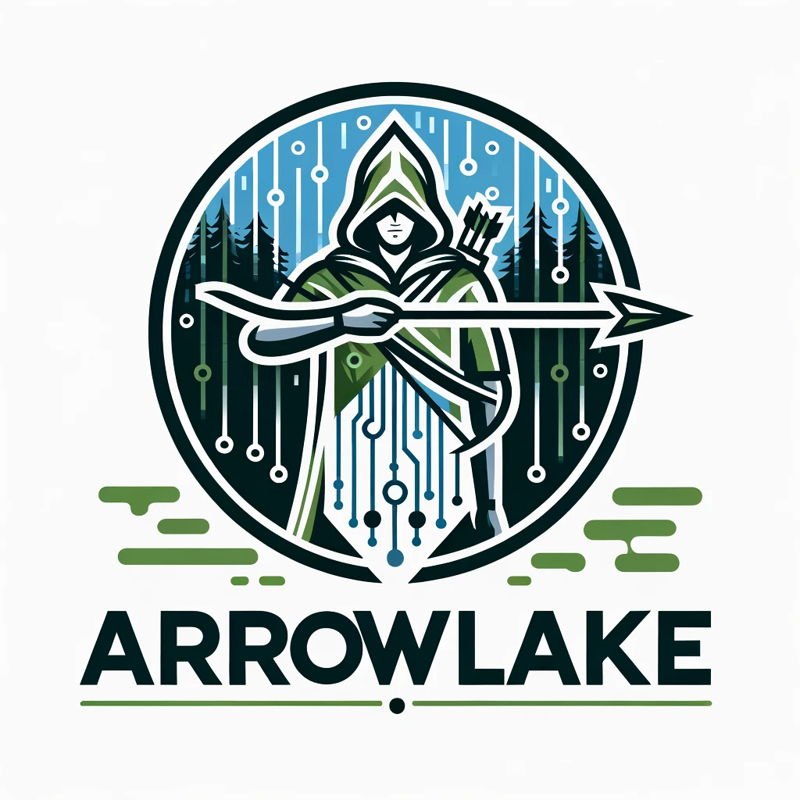

# :bow_and_arrow: ArrowLake

## The Robin Hood of Data Architecture

Welcome to the Sherwood Forest of Big Data - ArrowLake! Crafted by the merry data outlaws at Veloce Data Solutions, ArrowLake aims to liberate the data landscape from the clutches of overpriced and cumbersome big data platforms. Much like the legendary Robin Hood, ArrowLake is here to provide a powerful, cost-effective solution for all, championing the cause of efficient and accessible data processing.

## :deciduous_tree: About ArrowLake

In the heart of our data forest, ArrowLake stands as a beacon of innovation, blending the art of Golang, the strength of Rust, and the wisdom of Python. Armed with the prowess of Apache Arrow, this platform is on a quest to surpass the titans of big data realms like Redshift, but without plundering your coffers!

## :crossed_swords: Key Features

Apache Arrow Arsenal: Leveraging the in-memory columnar might of Apache Arrow, ensuring swift and efficient data processing.
Trilingual Alliance: A seamless blend of Golang's agility, Rust's brawn, and Python's cunning, united to form a formidable force in data processing.
Merry Cost-Efficiency: Crafted not for the kings and queens but for the common folk - offering top-tier capabilities without the royal price tag.
Scalable Stronghold: Constructed to grow with your needs, scaling without faltering, just as Robin's band of merry men grew in strength and number.
Open Source Fellowship: A community for all - open, collaborative, and thriving on innovation.

## :scroll: Prerequisites

Equip yourself with Golang, Rust, and Python - the weapons of choice in our data realm.
Arm yourself with Apache Arrow libraries for each language.
Embark with a basic map of data processing and analytics territory.

## :european_castle:: Architecture
Every inch of ArrowLake's architecture is crafted for resilience, scalability, and efficiency:

Swift Data Ingestion: As fast as Robin's arrows, leveraging Apache Arrow for efficiency.
Mighty Processing Engine: A blend of Golang's speed, Rust's power, and Python's versatility.
Fortified Storage: Both in-memory and persistent, safeguarding your data treasures.
Wise Query Engine: Delivering insights and analytics with the precision of an archer's aim.

## :handshake: Contributing

Join our band of merry contributors! Whether you're a bard singing tales of new features, a blacksmith forging fixes, or a scout spreading the word, your contributions are the lifeblood of ArrowLake. Check out CONTRIBUTING.md for guidelines.

## :compass: Roadmap

:heavy_check_mark: Initial foray into design and architecture
:construction: Crafting the trilingual alliance
:telescope: Enhancing our query quiver
:people_holding_hands: Rallying the open-source community
:chart_with_upwards_trend: Sharpening performance for the battles ahead
:page_facing_up: License
ArrowLake is bestowed upon the realm under the MIT License. Refer to the LICENSE scroll for more details.

## :bow_and_arrow: Author

Thomas F McGeehan V - The Robin Hood of Data!
