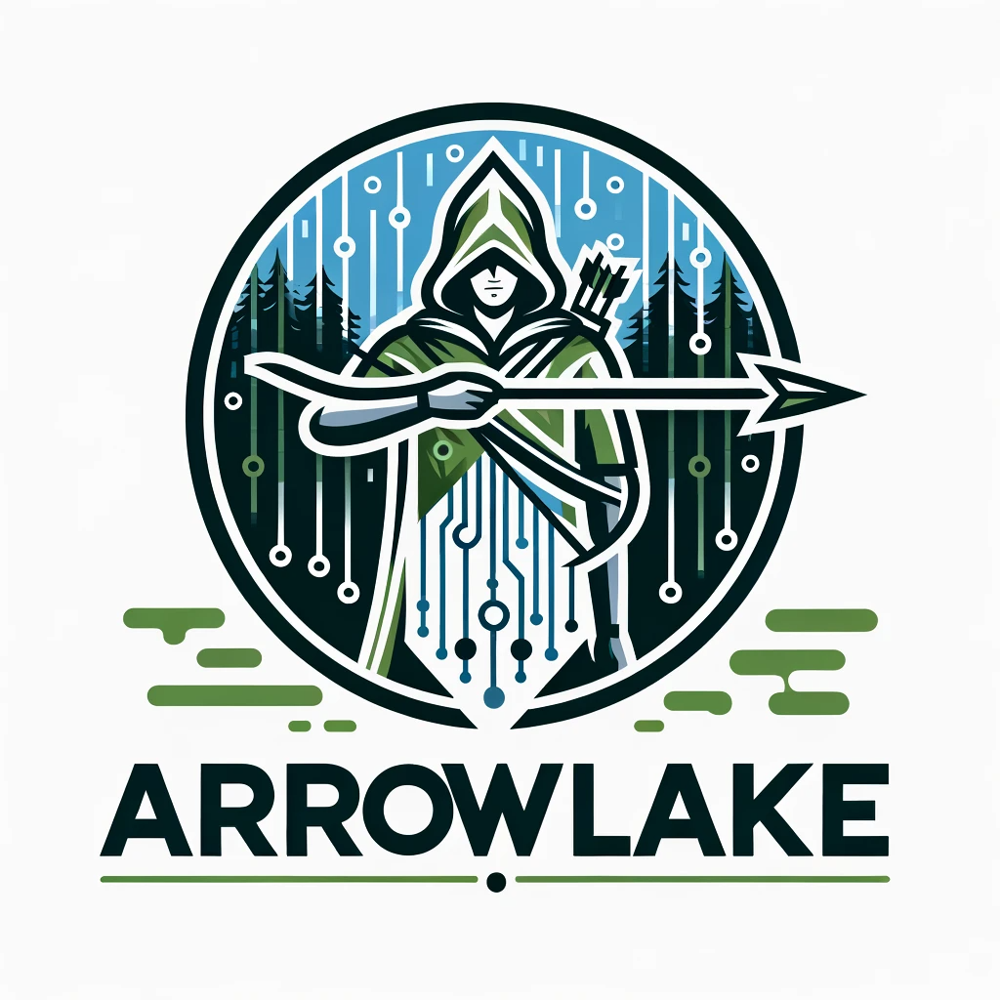

# :bow_and_arrow: ArrowLake

## The Robin Hood of Data Architecture

Welcome to the Sherwood Forest of Big Data - ArrowLake! Crafted by the merry data outlaws at Veloce Data Solutions, ArrowLake aims to liberate the data landscape from the clutches of overpriced and cumbersome big data platforms. Much like the legendary Robin Hood, ArrowLake is here to provide a powerful, cost-effective solution for all, championing the cause of efficient and accessible data processing.

## :deciduous_tree: About ArrowLake

In the heart of our data forest, ArrowLake stands as a beacon of innovation, blending the art of Go and Rust with the wisdom of DuckDB, Apache Arrow, and Apache Doris. Armed with the prowess of Apache Arrow, DuckDB, and Apache Doris, this platform is on a quest to surpass the titans of big data realms, but without plundering your coffers!

## :crossed_swords: Key Features

- **Apache Arrow Arsenal:** Leveraging the in-memory columnar might of Apache Arrow, ensuring swift and efficient data processing.
- **DuckDB Integration:** Utilizing DuckDB's powerful SQL engine for efficient querying and analytics directly on Arrow tables.
- **Rust Strength:** Utilizing Rust's performance and safety features to build a robust data processing platform.
- **Go Efficiency:** Harnessing Go's concurrency and simplicity for building scalable services.
- **Apache Doris:** Employing Apache Doris for high-performance, real-time analytical capabilities based on MPP architecture.
- **Merry Cost-Efficiency:** Crafted not for the kings and queens but for the common folk - offering top-tier capabilities without the royal price tag.
- **Scalable Stronghold:** Constructed to grow with your needs, scaling without faltering, just as Robin's band of merry men grew in strength and number.
- **Open Source Fellowship:** A community for all - open, collaborative, and thriving on innovation.

## :scroll: Prerequisites

- Equip yourself with Go and Rust - the weapons of choice in our data realm.
- Arm yourself with Apache Arrow, DuckDB, and Apache Doris libraries.
- Embark with a basic map of data processing and analytics territory.
- Google Cloud Platform (GCP) account for integration.

## :european_castle: Architecture

Every inch of ArrowLake's architecture is crafted for resilience, scalability, and efficiency:

- **Swift Data Ingestion:** As fast as Robin's arrows, leveraging Apache Arrow for efficiency.
- **Mighty Processing Engine:** Powered by DuckDB, DataFusion, Rust, and Go, ensuring robust and high-performance data processing.
- **Fortified Storage:** Utilizing Apache Iceberg for managing large datasets on GCS.
- **Federated Query Engine:** Enabling seamless querying across multiple data sources and formats.
- **Real-Time Analytics:** Leveraging Apache Doris for sub-second response times and high-throughput complex analysis.

## :handshake: Contributing

Join our band of merry contributors! Whether you're a bard singing tales of new features, a blacksmith forging fixes, or a scout spreading the word, your contributions are the lifeblood of ArrowLake. Check out CONTRIBUTING.md for guidelines.

## :compass: Roadmap

- [x] Initial foray into design and architecture
- [ ] Integrating Rust and DataFusion
- [ ] Enhancing federated query capabilities with DuckDB and Doris
- [ ] Utilizing Apache Doris for real-time analytics
- [ ] Rallying the open-source community
- [ ] Sharpening performance for the battles ahead

## :page_facing_up: License

ArrowLake is bestowed upon the realm under the MIT License. Refer to the LICENSE scroll for more details.

## :bow_and_arrow: Author

Thomas F McGeehan V - The Robin Hood of Data!
